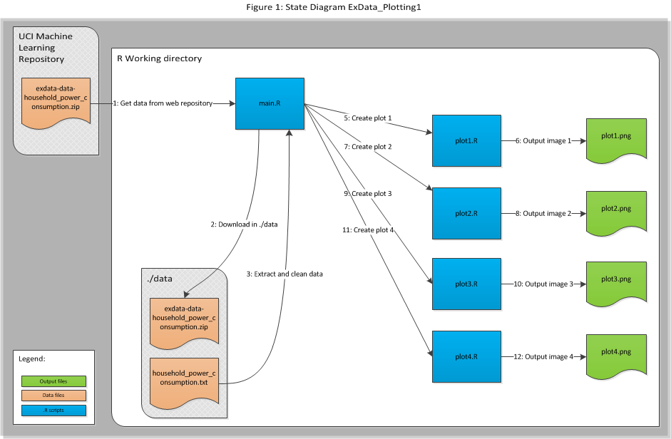

# Code Book: ExData_Plotting1

  >File Name: CodeBook.md  
  >Written By: Jovan Sardinha  
  >Created On: May 11, 2014  
  >Email: jovan.sardinha@gmail.com  
  >Operating System: Windows 7 (32 bit)  
  >R Version: R version 3.1.0 (2014-04-10)  
  >Github Repo: https://github.com/JovanSardinha/ExData_Plotting1

### Contents
   1 - Assumptions  
   2 - Base Criteria  
   3 - Code Documentation  
   4 - Variable Dictionary  
   5 - General Statistics
    

### Assumptions
##### Section outlines the base assumptions made when generating the output plots 
- <a href= "https://d396qusza40orc.cloudfront.net/exdata%2Fdata%2Fhousehold_power_consumption.zip"> This link from UCI Machine Learning Repository </a> is active and provides a .zip named *"exdata-data-household_power_consumption.zip".  
- Machine is running R version 3.1.0 or higher.   
- Machine has internet connectivity to the <a href="http://archive.ics.uci.edu/ml/"> UCI Machine Learning Repository</a>.   

### Base Criteria
##### Section outlines the base criteria required to generate the output (UCI-HAR-TidyDataSet.csv)  
1. Set the working directory where <code>main.R</code> is present and also where you expect the raw data files and tidy data set to be downloaded.  
2. Running the command <code>source("~/main.R")</code> will assuming that <code>main.R</code> is in the working directory. If not, the corresponding path to this file has to be provided in the call.

>Note: Running <code>main.R</code> will download roughly 146MB of data form the web and create a new directory './data', which will house all the downloaded data in the working directory. Furthermore, the plots (in .png format) will be placed in the working directory upon the completion of the <code>main.R</code> routine. Lastly, the R package "lubridate" will be installed automatically upon running this routine.

### Code Documentation
##### Section explains the overall extraction, cleaning and plot creating process 

>Note: The R file <code>main.R</code> and <code>plot*.R</code>, has inline documentation as required. The purpose of this section is to provide high-level guidance. For detailed information, refer to the source code. 
 

The steps taken to produce the 4 plots are illustrated below: 

 

  **Step 1**: Get data from web: Here, <code>main.R</code> connects to the UCI website and extracts the data.  
  **Step 2**: Download in ./data: <code>main.R</code> creates <code>./data</code> folder if it does not exist and dumps the .zip here.   
  **Step 3**: Extract  data: <code>main.R</code> extracts the data from the .zip file.  
  **Step 4**: Clean and subset data: Here the data set is cleaned up (dates converted and extra columns removed) and subset t according to the conditions specified in the *Loading the Data* section in the README.md.   
  **Steps 5,7,9,11**: Creating the respective plots. Here <code>main.R</code> sources and calls upon the respective .R file to create the necessary plot.  
  **Steps 6,8,10,12**: .png files are created and dumped into the working directory.  

### Variable Dictionary

>Note: format followed for Table 1 is outlined here:  
 "X"; indicates a variable in the R workspace   
 \- YYY; YYY indicates the explanation of the variable 
 

##### Table 1: R Variable Dictionary

###### 1.1 - Data frames
"origData" - original data downloaded from UCI and untouched    
"origDataClean" - Cleaned data set    

###### 1.2 - Other variables  
"dataDir" - location of the extracted data from UCI 
"file" - location of unzipped data  
"OrigDataURL" - URL of the UCI data location

### General Statistics

##### CPU Time Measures: 
 - user: 33.24s  
 - system: 3.42s  
 - elapsed 46.80s  

##### File/Folder Sizes: 
 - **./data** folder: 146MB
 - *.png: 19KB  
 - Overall folder (after <code>main.R</code> execution): 147MB  

